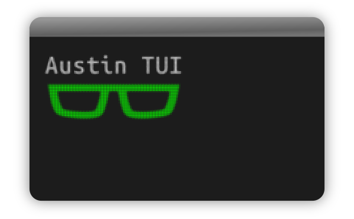
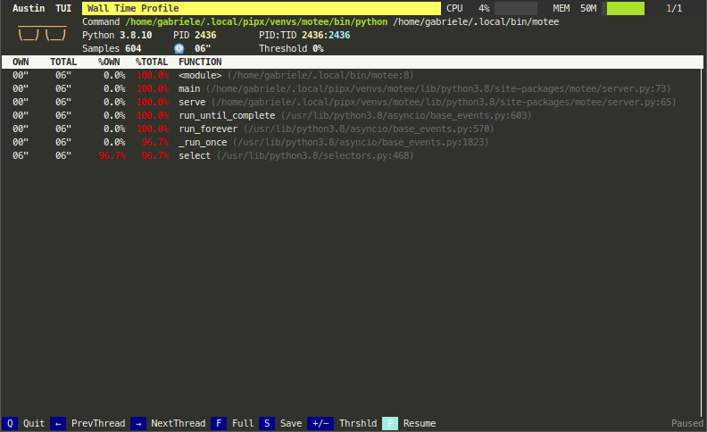
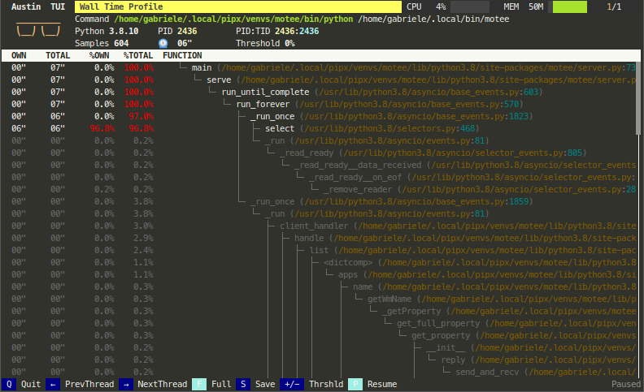

    

<h3 align="center">A Top-like Interface for Austin</h3>

  
  &nbsp;&nbsp;&nbsp;&nbsp;
  
  &nbsp;&nbsp;&nbsp;&nbsp;
  

  
  
  <!--  -->
  
  

  <a href="#synopsis"><b>Synopsis</b></a>&nbsp;&bull;
  <a href="#installation"><b>Installation</b></a>&nbsp;&bull;
  <a href="#usage"><b>Usage</b></a>&nbsp;&bull;
  <a href="#compatibility"><b>Compatibility</b></a>&nbsp;&bull;
  <a href="#contribute"><b>Contribute</b></a>

  

# Synopsis

The Python TUI is a top-like text-based user interface for Austin, written in
pure Python. Originally planned as a sample application to showcase Austin uses,
it's been promoted to a full-fledged project thanks to great popularity.

  

The header shows you the information of the application that is being profiled,
like its PID, the command line used to invoke it, as well as a plot of the
amount of CPU and memory that is being used by it, in a system-monitor style.

# Installation

Austin TUI can be installed directly from PyPI with

~~~ bash
pip install austin-tui --upgrade
~~~

**NOTE** In order for the TUI to work, the Austin 2 binary needs to be on the
``PATH`` environment variable. See [Austin
installation](https://github.com/P403n1x87/austin#installation) instructions to
see how you can easily install Austin on your platform.

# Usage

Once Austin and Austin TUI are installed, you can start using them
straight-away. If you want to launch and profile a Python script, say
`myscript.py`, you can do

~~~ bash
austin-tui python3 myscript.py
~~~

or, if `myscript.py` is an executable script,

~~~ bash
austin-tui myscript.py
~~~

Like Austin, the TUI can also attach to a running Python application. To analyse
the frame stacks of all the processes of a running WSGI server, for example, get
hold of the PID of the parent process and do

~~~ bash
sudo austin-tui -Cp <pid>
~~~

The `-C` option will instruct Austin to look for child Python processes, and you
will be able to navigate through them with the arrow keys.

> The TUI is based on `python-curses`. The version included with the standard
> Windows installations of Python is broken so it won't work out of the box. A
> solution is to install the the wheel of the port to Windows from
> [this](https://www.lfd.uci.edu/~gohlke/pythonlibs/#curses) page. Wheel files
> can be installed directly with `pip`, as described in the
> [linked](https://pip.pypa.io/en/latest/user_guide/#installing-from-wheels)
> page.

## Full mode

By default, Austin TUI shows you statistics of the last seen stack for each
process and thread when the UI is refreshed (about every second). This is
similar to what top does with all the running processes on your system.

  

If you want to see all the collected statistics, with the frame stacks
represented as a rooted tree, you can press `F` to enter the _Full_ mode. The
last seen stack will be highlighted so that you also have that information
available while in this mode.

  

## Save statistics

Peeking at a running Python application is nice but in many cases you would want
to save the collected data for further offline analysis (for example, you might
want to represent it as a flame graph). At any point, whenever you want to dump
the collected data to a file, you can press the `S` key and a file with all the
samples will be generated for you in the working directory, prefixed with
`austin_` and followed by a timestamp. The TUI will notify of the successful
operation on the bottom-right corner.

  

# Compatibility

Austin TUI has been tested with Python 3.6-3.9 and is known to work on
**Linux**, **MacOS** and **Windows**.

Since Austin TUI uses Austin to collect samples, the same note applies here:

> Due to the **System Integrity Protection** introduced in **MacOS** with El
> Capitan, Austin cannot profile Python processes that use an executable located
> in the `/bin` folder, even with `sudo`. Hence, either run the interpreter from
> a virtual environment or use a Python interpreter that is installed in, e.g.,
> `/Applications` or via `brew` with the default prefix (`/usr/local`). Even in
> these cases, though, the use of `sudo` is required.

# Contribute

If you like Austin TUI and you find it useful, there are ways for you to
contribute.

If you want to help with the development, then have a look at the open issues
and have a look at the [contributing guidelines](CONTRIBUTING.md) before you
open a pull request.

You can also contribute to the development of the Austin TUI by becoming a
sponsor and/or by [buying me a coffee](https://www.buymeacoffee.com/Q9C1Hnm28)
on BMC or by chipping in a few pennies on
[PayPal.Me](https://www.paypal.me/gtornetta/1).

  

